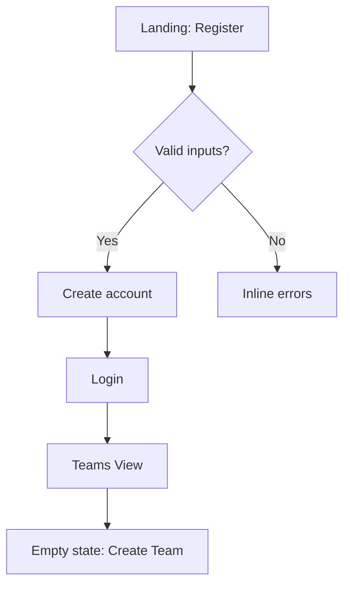
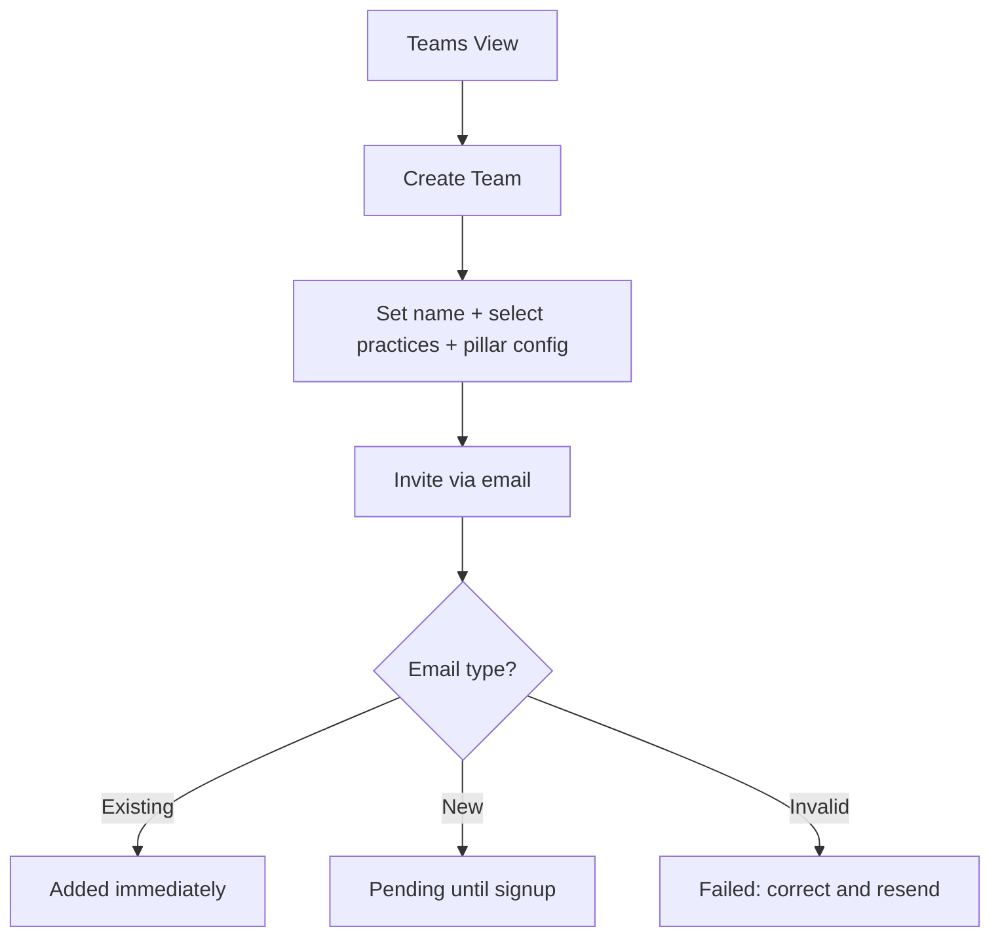
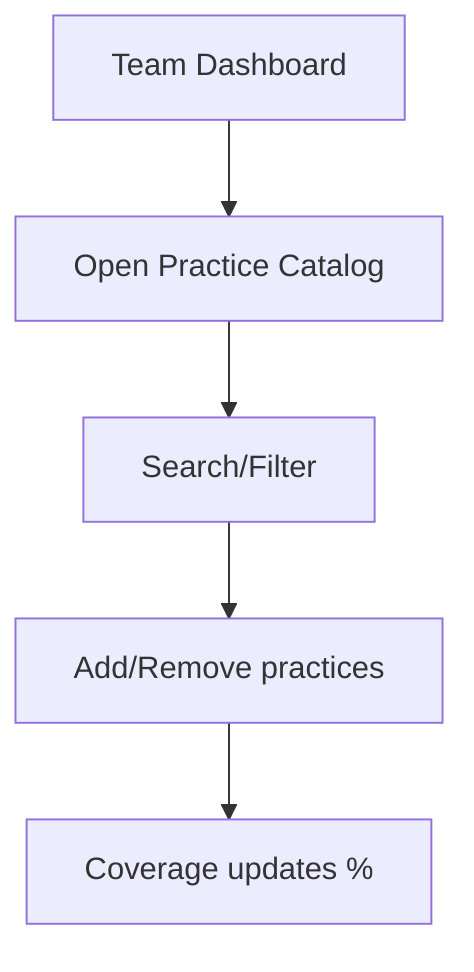
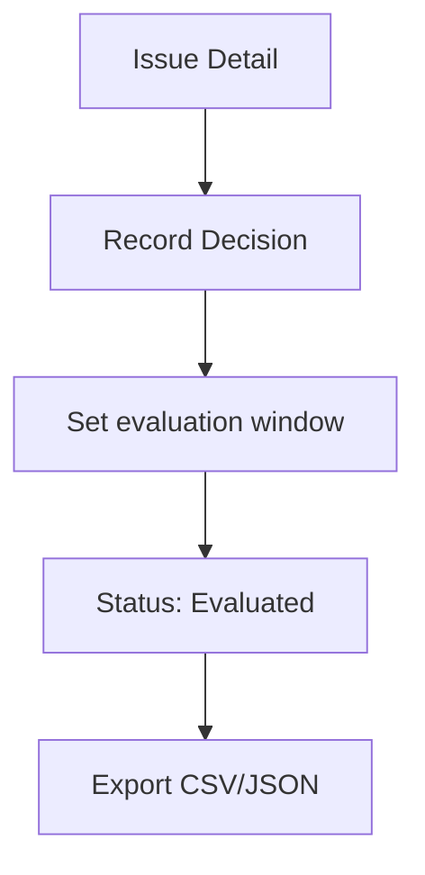

stepsCompleted: [1, 2, 3, 4, 5, 6, 7, 8, 9, 10, 11, 12, 13]
inputDocuments:
  - prd.md
  - product-brief-bmad_version-2026-01-14.md
---

# UX Design Specification bmad_version

**Author:** nicolas
**Date:** 2026-01-14

---

<!-- UX design content will be appended sequentially through collaborative workflow steps -->

## Executive Summary

### Project Vision
A research-grade platform where teams surface individual agile practice friction, see personality-aware context, discuss options, and commit to adaptations—backed by immutable event logs and a fast, reliable MVP.

### Target Users
Developers needing low-friction ways to flag practice pain (e.g., introverted pros), student developers seeking structured guidance, and facilitators craving clear visibility and traceable decisions.

### Key Design Challenges
Streamline the issue→discussion→decision→evaluation loop with zero hand-holding; present conflict resolution with clarity and safety; make research logging transparent but non-intrusive; keep personality insights supportive, not prescriptive.

### Design Opportunities
A steady, guided Issue Detail experience; a coverage/dashboard hub that ties practices, issues, and adaptations together; gentle personality context cues; export/trace flows that build confidence in data integrity.

## Core User Experience

### Core Action
Issue submission as the primary developer interaction—low-friction, self-explanatory, the gateway to the entire adaptation workflow.

### Platform Strategy
Desktop web, mouse/keyboard interaction. No mobile, offline, or touch considerations. Simple, standard UI (CSS library OK).

### Effortless Interactions
- Optimistic conflict handling with safe, clear resolution paths
- Transparent logging (every action logged, but non-intrusive and calm)
- Clear system feedback (user always knows what happened and what's next)

### Critical Success Moments
- **First issue submission**: Developer's first practice complaint must feel safe, simple, and rewarding. If confusing or heavy, they won't voice friction again.
- **First conflict resolution**: User encounters a 409 conflict. Safe, reversible paths (with clear diffs and auto-saved drafts) build trust in the system.
- **First data export**: Facilitator/researcher exports events. Complete, accurate data validates that the system is capturing what matters.
- **First adaptation decision**: Team records a practice change. Clear decision logging ensures the adaptation is memorable and traceable.

### Experience Principles
- Always show the next step
- Conflicts are safe and reversible
- Research trace is visible but calm
- Discussion is facilitated outside the system; only decisions and events are logged
- Issue submission is the hero flow; everything else supports it

## Desired Emotional Response

### Primary Emotional Goals
Users should feel **safe, empowered, and heard**. Developers speaking up about practice friction should experience no judgment and immediate clarity that their voice matters. The system responds transparently and moves issues forward without bureaucracy.

### Emotional Journey Mapping
- **Arrival**: Calm, approachable interface. No overwhelming navigation.
- **First Issue**: Safe to speak. Form feels lightweight. "I can do this."
- **Conflict**: Panic → relief. Clear diff, reversible options, auto-saved draft. "This is handled."
- **Decision**: Momentum. Clear next step. "We're moving forward together."
- **Export**: Trust. Complete data. "The system captured what matters."

### Micro-Emotions
- **Confidence** (over confusion): Self-explanatory flows, clear next steps always visible.
- **Safety** (over anxiety): Conflicts are reversible; data is immutable but transparent; no data loss.
- **Trust** (over skepticism): Logging is honest; export validates completeness; research integrity is obvious.
- **Belonging** (over isolation): Personality context normalizes differences; system works for pros and students alike.
- **Momentum** (over stagnation): Issue→decision→tracking feels lightweight and moves forward.

### Design Implications
- Clear visual feedback at every step (user always knows what happened and what's next)
- Conflict resolution surfaces diffs, auto-saved drafts, and safe merge paths
- Logging indicators are calm and reassuring, not intrusive
- Language and UI patterns feel consistent, predictable, and student-friendly
- Data export is straightforward and validates completeness

### Emotional Design Principles
- Safety through transparency: Every action logged, nothing hidden, but not surveilling
- Empowerment through clarity: Always show the next step and why we're here
- Trust through data integrity: Research-grade logging validates the system's purpose
- Belonging through simplicity: Works out of the box; no tutorials needed

## UX Pattern Analysis & Inspiration

### Inspiring Products Analysis

**MS Teams**
- Threading model keeps conversations coherent without overwhelming
- Lightweight composition (quick replies, no heavy modals)
- Channels organize context without forcing deep menus
- Status signaling is clear and non-intrusive

**Jira**
- Issue detail view is the hub—all context visible at a glance
- Status workflow is crystal clear (states, transitions, who moved it)
- Comments are chronological and traceable; history is always available
- Priority and impact visible without clicking through layers

**Outlook**
- Conversation grouping shows discussion flow instantly
- Flag/priority system is subtle but powerful
- Calendar context integrated naturally (knows *when* actions matter)
- Minimal friction between reading and responding

**VS Code / IntelliJ**
- Errors and warnings are immediate, clear, and actionable
- Sidebar keeps context visible without cluttering the main view
- Consistent, predictable patterns across interactions
- Response is instant—no lag between intent and feedback

### Transferable UX Patterns

**Discussion & Threading** (from Teams, Jira, Outlook)
- Nest issue description at top, chronological comments below
- Show who said what, when, with clear attribution
- Threading keeps signal high and noise low

**Status Clarity** (from Jira)
- Status badges always visible on list and detail views
- Show last action and who took it (builds transparency)
- Workflow transitions clear: what states are next, who can move it

**Activity & History** (from Jira, Outlook)
- Activity feed shows all changes chronologically
- "Someone updated X at Y time" is visible without clicking
- Builds trust through transparency

**Lightweight Composition** (from Teams, VS Code)
- Single-field issue submission first (describe the problem)
- Secondary details optional, not required upfront
- No heavy modals; forms appear in-context or as sidebars

**Instant Feedback** (from VS Code)
- Save is immediate, no lag
- Feedback appears inline, not in separate notifications
- Errors are clear and suggest next steps

**Sidebar Context** (from VS Code, Jira)
- Practice catalog sidebar keeps options visible without leaving detail view
- Coverage score sidebar shows impact at a glance
- Personality context gentle sidebar hint (not center stage)

### Anti-Patterns to Avoid

- Heavy modal dialogs that block context (Jira sometimes does this—we won't)
- Unclear status states or hidden workflows
- Forcing all fields upfront before saving (Outlook form complexity)
- Lagging interactions or slow saves (kills trust)
- Deep menu hierarchies (Teams avoids this well—we'll follow suit)
- History that's hidden or requires clicking to see
- Personality data presented as "recommendations" (feels prescriptive; we'll frame as context)

### Design Inspiration Strategy

**What to Adopt:**
- Jira's issue-detail-as-hub pattern (issue description + comments + status + activity)
- Teams' lightweight composition (optional secondary fields)
- VS Code's instant feedback and error clarity
- Outlook's conversation grouping

**What to Adapt:**
- Jira's status workflow → our decision/adaptation lifecycle (submitted → discussed → decided → evaluated)
- Teams' threading → our issue comments (chronological, traceable)
- VS Code's sidebar context → our coverage/personality sidebar
- Jira's activity feed → our event log (transparent but calm)

**What to Avoid:**
- Jira's complex modal dialogs (we'll inline everything)
- Outlook's email-like folder structures (flat structure for simplicity)
- Heavy notification systems that interrupt (Teams sometimes overdoes this)
- Slow interactions or lag (everything must feel instant)

## Design System Foundation

### Design System Choice
**Tailwind CSS** with custom component library for bmad_version.

### Rationale for Selection
- **Speed**: Utility-first approach enables rapid MVP development within the 3-week timeline
- **Control**: Full visual customization without opinionated component defaults; creates calm, minimal interface aligned with our emotional goals
- **Lightness**: Minimal overhead; no heavy component library bloat; desktop-only focus doesn't require responsive complexity
- **Team fit**: Solo or small developer team can move fast without learning curve of component frameworks
- **Desktop first**: Tailwind excels at precise desktop layouts; no mobile concerns to distract
- **Research integrity**: Clean, minimal UI keeps focus on data and decisions, not visual flash

### Implementation Approach
1. **Base**: Tailwind CSS with custom color palette (calm grays, subtle accent colors for status/actions)
2. **Custom Components**: Build 5-8 core components as reusable modules:
   - Issue Detail card (description + comments + status + activity)
   - Conflict Resolution modal (diff view + merge options + auto-draft indicator)
   - Coverage dashboard widget (simple bar chart or % score)
   - Decision record card (timestamp + decision + rationale)
   - Event log entry (actor + action + timestamp + payload preview)
   - Status badge (submitted, discussed, decided, evaluated)
   - Sidebar panels (practice catalog, personality context, activity feed)
3. **Design Tokens**: Define Tailwind config for spacing, typography, colors, shadows (all supporting calm, clear aesthetic)
4. **Patterns**: Establish reusable interaction patterns (form composition, data tables, inline editing, conflict resolution flow)

### Customization Strategy
- **Color Palette**: Neutral base (grays 50-900) + 2 accent colors (one for actions/highlights, one for conflict/warning)
- **Typography**: System font stack (no custom fonts); clear hierarchy (heading sizes, body, labels)
- **Spacing**: Consistent 4px/8px grid; generous whitespace supporting clarity and calmness
- **Shadows**: Minimal drop shadows only on modals/conflicts; flat design elsewhere
- **Interaction**: Instant feedback on save; clear hover/focus states; smooth transitions (not jarring)

## Core User Experience Definition

### Defining Experience
**Issue submission in < 2 minutes, feeling safe and heard.** A developer describes a practice difficulty, sees it saved instantly, and knows their team will see it immediately. No bureaucracy, no judgment, no data loss.

### User Mental Model
Developers currently raise practice concerns informally (coffee chats, Slack complaints) because no structured path exists. They expect:
- Simple form, not a survey
- Reassurance that speaking up is safe (won't get them labeled "difficult")
- Immediate confirmation their issue was captured
- Clear sense of what happens next (team sees it, discussion follows)

Existing solutions (Jira, Google Forms) feel heavy for a simple practice concern—they introduce friction when the goal is capturing voice, not formal bug reports.

### Success Criteria for Core Experience
- Developer can submit an issue without reading documentation
- Form feels lightweight, not comprehensive
- Auto-save prevents data loss if interrupted
- Instant feedback: "Your issue is saved and visible to the team"
- Time-to-submit: < 2 minutes from "I want to raise something" to "It's in the system"
- Emotional outcome: "That was easy. I'll do that again if something comes up."

### Established Patterns
We use proven patterns that developers already understand:
- **Form composition** (from Outlook, Teams): Simple fields, optional secondary details
- **Instant feedback** (from VS Code): Save is immediate, no lag, clear indicator
- **Auto-draft** (from modern text editors): Drafts preserved in background
- **Activity visibility** (from Jira): Issue appears in team feed instantly, not hidden in a database

No novel interaction needed—we innovate by removing friction, not inventing new gestures.

### Experience Mechanics

**1. Initiation**
- Developer lands on Team view after login
- Prominent "Submit an issue" button (or keyboard shortcut)
- Clear call-to-action: "Describe a practice difficulty"

**2. Interaction**
- Form modal/panel appears with 3 fields:
  - **Practice**: Dropdown (searchable) of team's selected practices
  - **Difficulty**: Text area (placeholder: "What's hard about this practice?")
  - **Context** (optional): Additional details, timing, who else struggles
- Auto-save every keystroke (draft indicator shows in sidebar)
- No submit button required—save happens as they type

**3. Feedback**
- Visual confirmation: "Saved at 2:34 PM"
- Practice pill shows selected practice
- Word count indicator (e.g., "87 characters")
- Clear next step visible: "Your team sees this. You can add comments below or close this."

**4. Completion**
- Issue appears immediately in Team's issue feed
- Developer can see it in context (not filed away)
- Optional: Add comments, see personality context of teammates, watch discussion unfold
- If user navigates away, draft is preserved; they can return to refine anytime

## Visual Design Foundation

### Color System

**Palette Strategy**: Neutral base with purposeful accents—calm and professional, supporting safety and transparency.

- **Neutral Base** (Slate/Zinc scale):
  - `Slate-50` through `Slate-900`: Full spectrum for backgrounds, borders, text
  - Supporting accessibility: High contrast between text and backgrounds (WCAG AA minimum)
  - `Slate-100` (light backgrounds), `Slate-700/800` (text)

- **Accent Colors**:
  - **Primary Action** (Teal/Cyan): Calls-to-action, issue status changes, save confirmations
    - Use `Teal-500/600` for buttons; `Teal-50` for highlights
  - **Caution/Conflict** (Amber/Orange): Warnings, conflict resolution, attention needed
    - Use `Amber-500/600` for alerts; `Amber-50` for warning backgrounds

- **Semantic Mapping**:
  - **Submitted** (blue): New issue, fresh voice
  - **Discussed** (slate): Team reviewing, in motion
  - **Decided** (teal): Team committed to change
  - **Evaluated** (slate-600): Resolved, archived
  - **Conflict** (amber): 409 state, needs user attention
  - **Success** (green): Auto-save confirmed, data persisted

### Typography System

**Tone**: Professional but human. Clear hierarchy, generous spacing. System fonts (no custom typeface overhead).

- **Font Stack**: `-apple-system, BlinkMacSystemFont, "Segoe UI", Roboto, "Helvetica Neue", Arial, sans-serif`
  - Fast load, familiar to users across devices
  - Excellent readability on desktop

- **Type Scale** (Tailwind defaults):
  - `H1`: 2.25rem (36px), font-weight 700, tracking tight
  - `H2`: 1.875rem (30px), font-weight 600
  - `H3`: 1.5rem (24px), font-weight 600
  - `Body`: 1rem (16px), font-weight 400, leading-relaxed (1.625)
  - `Small`: 0.875rem (14px), font-weight 400
  - `Label`: 0.75rem (12px), font-weight 500, uppercase tracking

- **Line Height & Spacing**:
  - Body text: 1.625 (relaxed)—generous whitespace for scanning
  - Headings: 1.25 (tight)—authority and hierarchy
  - Lists: 1.75—easier to parse

### Spacing & Layout Foundation

**Grid System**: 8px base unit (Tailwind default spacing scale).

- **Whitespace Strategy**:
  - Generous breathing room between sections
  - Issue Detail card: 24px padding inside (3x 8px)
  - Between cards: 16px gaps (2x 8px)
  - Section breaks: 32px (4x 8px)

- **Component Spacing**:
  - Form fields: 8px between label and input, 12px between fields
  - List items: 8px vertical, 12px horizontal padding
  - Comments: 16px padding left (indentation for nested structure)

- **Layout Approach**:
  - **Main content**: Full-width on desktop (desktop-only, no responsive breakpoints)
  - **Sidebar**: Fixed right sidebar (practice catalog, personality context) ~280px wide
  - **Footer**: Hidden or minimal; footer actions inline in detail views
  - **Cards/Containers**: Max-width 1200px for readability; center on larger screens

### Accessibility Considerations

- **Contrast Ratios**: All text meets WCAG AA minimum (4.5:1 for normal text, 3:1 for large)
- **Focus States**: Clear 2px outline on `:focus` (using accent color), 4px offset
- **Semantic HTML**: `<button>`, `<input>`, `<label>`, `<article>` for proper announcements
- **Color Not Alone**: Status badges use color + icon/text label (never color-only for meaning)
- **Motion**: Transitions smooth (200-300ms), not jarring; respect `prefers-reduced-motion`
- **Font Size Minimum**: No smaller than 12px for body text; labels clear and readable

## User Journey Flows

### Signup → Teams View

New user creates account and lands in the Teams context quickly.



• Entry: Register form (name, email, password) → login auto-redirect.
• Feedback: Inline validation; success toast; session visible.
• Success: Reaches Teams view with clear CTA.

### Create Team → Invite Members

Any team member can create teams, configure practices/pillars, and invite others via email.



• Entry: Teams view.
• Feedback: Status chips (Added/Pending/Failed).
• Success: Team shows memberships across teams.

### Practice Catalog → Coverage Dashboard

Browse and manage team practices; see coverage %.



• Entry: Team dashboard.
• Feedback: Immediate coverage % changes; simple visualization.
• Success: Portfolio curated; gaps visible.

### Submit Issue (Hero Flow)

Developer raises a practice difficulty in <2 minutes.

```mermaid
flowchart TD
  I1[Team View] --> I2[Submit Issue]
  I2 --> I3[Fields: Practice + Difficulty + Context(opt)]
  I3 --> I4{Auto-save}
  I4 --> I5[Saved ✓ + visible to team]
  I5 --> I6[Issue appears in feed]
```

• Entry: Prominent button/shortcut.
• Feedback: Auto-save indicator; next step guidance.
• Success: Issue visible; developer feels heard.

### Conflict Resolution (Optimistic Locking)

User edits stale item; non-destructive resolution.

```mermaid
flowchart TD
  C1[Open Issue Detail] --> C2[Edit]
  C2 --> C3{409 Conflict?}
  C3 -- No --> C4[Save]
  C3 -- Yes --> M1[Modal: Options]
  M1 --> M2[Apply latest + re-apply]
  M1 --> M3[Overwrite (if permitted)]
  M1 --> M4[Save edits as comment]
  M2 --> C4
  M3 --> C4
  M4 --> C4
```

• Entry: Edit existing item.
• Feedback: Clear diff; reversible options; auto-draft.
• Success: No data loss; trust increases.

### Decision Logging → Evaluation → Export

Facilitator logs team decision; evaluate; export events.



• Entry: Issue detail.
• Feedback: Status change + activity feed entry.
• Success: Traceable decision; complete export.

### Journey Patterns

- Navigation: Dashboard hubs + in-context panels; minimal deep menus.
- Decision: Clear status transitions with who/when; reversible where appropriate.
- Feedback: Inline, immediate; toast and inline indicators; calm logging presence.

### Flow Optimization Principles

- Minimize steps to value; progressive disclosure for optional details.
- Make error recovery safe and obvious; preserve drafts.
- Keep context visible (sidebars: coverage, catalog, personality hints).

## Component Strategy

### Design System Components
- Tailwind CSS utilities for layout, spacing, typography, color.
- Base elements: buttons, inputs, selects, cards, panels, badges using semantic classes.
- Accessibility helpers: focus states, aria-label patterns, semantic HTML.

### Custom Components

#### IssueCard
- Purpose: Compact list item showing status, title, practice, author/time.
- Usage: Team view issues list; click to open detail.
- States: default, hover, selected.
- Variants: with/without conflict indicator.
- Accessibility: role="article"; status badge has text label.
- Interaction: onOpen(), onTriggerConflict().

#### IssueDetail
- Purpose: The hub—description, comments, status, activity.
- Usage: Detailed view for discussion/decision logging.
- States: submitted, discussed, decided, evaluated.
- Variants: read-only vs facilitator-enhanced actions.
- Accessibility: landmarks for sections; headings; aria-live for status updates.
- Interaction: onAddComment(text), onRecordDecision(payload), onExportTrace().

#### ConflictModal
- Purpose: Resolve optimistic locking conflicts safely.
- Content: Your edits vs latest server state diff.
- Actions: Apply latest + re-apply, Overwrite (if permitted), Save edits as comment, Cancel.
- States: open/closed; disabled buttons when permission missing.
- Accessibility: role="dialog"; aria-modal; keyboard trap; Esc to close.
- Interaction: onApplyLatest(), onOverwrite(), onSaveAsComment(), onClose().

#### CoverageWidget
- Purpose: Show team coverage % and pillars note.
- Content: % bar, textual note of covered pillars.
- States: varying %; empty state when no practices.
- Accessibility: bar labeled with aria-valuenow/aria-valuemin/max.
- Interaction: none (read-only), optional onOpenCatalog().

#### StatusBadge
- Purpose: Visual status with color + text.
- Variants: submitted, discussed, decided, evaluated, conflict, success.
- Accessibility: always includes text; not color-only.

#### SidebarPanel
- Purpose: Container for catalog/personality/activity.
- States: collapsible; scrollable content.
- Accessibility: region landmark with aria-label.

#### ActivityFeed
- Purpose: Chronological list of actions.
- Content: actor, action, timestamp, optional payload preview.
- Accessibility: list semantics; time elements; readable contrast.

#### ExportPanel
- Purpose: Filter events by type/date and export CSV/JSON.
- States: loading, success, error.
- Accessibility: form semantics; button labels specify format.

#### FormField
- Purpose: Standardized label+input+hint+error.
- States: default, focused, error.
- Accessibility: label `for`, input `id`, describedby links.

#### Toast/Feedback
- Purpose: Inline and toast confirmations (e.g., Saved ✓).
- Variants: success, warning.
- Accessibility: aria-live="polite".

### Component Implementation Strategy
- Build custom components using Tailwind tokens (spacing 8px grid, slate/teal/amber palette).
- Encapsulate state via small reactive hooks; keep props simple (data in, events out).
- Follow established patterns: hub-based detail views, inline feedback, reversible actions.
- Enforce AA contrast; keyboard and screen reader support for all interactive elements.

### Implementation Roadmap
- Phase 1 (Core): IssueCard, IssueDetail, ConflictModal, StatusBadge, CoverageWidget.
- Phase 2 (Supporting): SidebarPanel, ActivityFeed, FormField, Toast/Feedback.
- Phase 3 (Enhancements): ExportPanel, advanced catalog filters, personality quick-links.

## Design Direction Decision

### Design Directions Explored
- Calm Slate, Teal Focus, Blue Minimal, Warm Amber, Monochrome, Dense Pro, Spacious Calm, High Contrast.
- Variations included layout density, accent usage, contrast levels, and spacing scales; all showcased Team view, Issue detail, conflict modal, coverage widget, and sidebar context.

### Chosen Direction
- **Teal Focus** theme with generous spacing and system fonts.
- Default interaction accents in teal/cyan; amber used sparingly for warning/conflict.

### Design Rationale
- Aligns with emotional goals: calm, safe, and transparent while feeling modern and professional.
- Accents guide attention without visual noise; teal supports “decision clarity,” amber signals “handle with care.”
- Readable density for desktop-only MVP; predictable patterns reduce cognitive load for pros and students.

### Implementation Approach
- Tailwind CSS base with semantic color tokens mapped to statuses (submitted/discussed/decided/evaluated/conflict/success).
- Components: Issue list, Issue detail card, Conflict Resolution modal, Coverage widget, Sidebar panels.
- Accessibility: AA contrast minimum; clear focus states; status badges include icon/text.

## UX Patterns

### Forms
- Labels: left-aligned above inputs; required fields marked with *.
- Help text: brief guidance under inputs; show only when useful.
- Validation: inline, immediate; error message under field with specific guidance.
- Optional fields: clearly marked; progressive disclosure for advanced details.
- Keyboard: Tab order logical; Enter submits where appropriate; Esc cancels dialogs.
- Save behavior: auto-save on change for Issue fields; explicit Save in complex forms.
- Placeholders: informative but not instructional; avoid relying on placeholder alone.

### Lists & Tables
- Row content: status badge, practice, title excerpt, author/time; optional conflict indicator.
- Density: ~56px row height; 12px horizontal padding; clear hover.
- Sorting: by status, last updated, practice; default by last updated.
- Filtering: simple filter bar with search + practice dropdown.
- Empty state: clear CTA to submit first issue; supportive copy.
- Keyboard: Up/Down to navigate; Enter to open IssueDetail.

### Detail Views
- Layout: left main content (description, comments); right fixed sidebar (catalog, coverage, personality hints).
- Sections: Description, Comments, Status, Activity; headings and landmarks.
- Editing: inline; transitions are smooth (200�300ms) and reversible.
- Save feedback: inline �Saved ? at HH:MM�; aria-live announcements.
- History: activity feed visible in context; transparent logging.

### Feedback & Toasts
- Inline first: confirmations appear near the action.
- Toasts: minimal, non-blocking; success 2�3s, warning 4�6s.
- Severity mapping: success (teal/green), warning (amber), info (slate).
- Language: calm, direct, student-friendly; avoids blame.

### Status & Badges
- Consistent labels: Submitted, Discussed, Decided, Evaluated, Conflict, Success.
- Color + text: never color alone; badge includes label.
- Last action: show who and when on detail and list views.

### Modals & Dialogs
- Safe defaults: primary button is the safest action; destructive actions secondary.
- Dismissal: Esc closes; clicking backdrop cancels if safe; explicit Cancel always available.
- Focus: trapped within dialog; initial focus on first actionable element.

### Navigation
- Top-level: Teams, Practices, Issues, Dashboard.
- In-context: anchor links within IssueDetail for sections.
- Shortcuts: Ctrl+I open Submit Issue; Ctrl+F focus search.

### Empty States
- Clear CTA: �Submit your first issue� or �Add practices�.
- Guidance: one sentence of purpose; no heavy illustration.
- Sample: optional example item to set expectations.

### Inline Editing
- Click-to-edit fields; convert into FormField with label, hint, and error.
- Commit: auto-save on blur; Escape cancels.
- Conflict hook: invokes ConflictModal on 409.

### Errors & Validation
- Severity: error (blocking), warning (non-blocking), info (context).
- Messages: specific, actionable, concise; include next-step guidance.
- Recovery: primary path to fix inline; avoid sending users away.
- Trace: show log/event ID for research integrity when relevant.

### Keyboard & Accessibility
- Focus order: logical and visible; 2px outline, 4px offset.
- Shortcuts: advertised in tooltips; discoverable via Help.
- ARIA: landmarks for regions; labels for controls; time elements for timestamps.

### Loading & Save Indicators
- Lists: skeleton rows for initial load.
- Detail: skeleton for description; spinner only when blocking.
- Save: inline �Saved ?�; never ambiguous.

### Conflict Resolution (Pattern)
- Trigger: stale edit detected (409). Show ConflictModal.
- Options: Apply latest + re-apply, Overwrite (if permitted), Save edits as comment.
- Default: Apply latest + re-apply (safe path); diff visible; reversible.
- Draft: auto-saved; never lose user input.

### Copy Language Tokens
- Submit Issue ? �Describe a practice difficulty�
- Saved ? ? �Saved at HH:MM�
- Conflict detected ? �Your copy is out of date; choose how to proceed.�
- Decision recorded ? �Team committed to change�
- Export complete ? �Events export ready�

## Page Templates & Developer Handoff

### Core Page Templates

#### Teams View
**Purpose**: Landing page after login; overview of user's teams and quick access to team dashboards.
**Layout**: Full-width list of team cards; each card shows team name, member count, coverage %, and CTA to enter dashboard.
**Components**: TeamCard, CoverageWidget, EmptyState (when no teams).
**Interactions**: Click team card  navigate to Team Dashboard.
**States**: Loading skeleton, populated list, empty state.

#### Team Dashboard
**Purpose**: Hub for selected team; shows issues list, quick stats, and access to catalog/practices.
**Layout**: Left main content (issues list); right fixed sidebar (coverage widget, practice catalog).
**Components**: IssueCard[], CoverageWidget, SidebarPanel (practice catalog), "Submit Issue" CTA.
**Interactions**: Click issue  open IssueDetail; click "Submit Issue"  open submission form.
**States**: Loading, populated, empty (no issues yet).

#### Issue Detail View
**Purpose**: The hubissue description, comments, status, activity, decision logging.
**Layout**: Left main content (description, comments, status timeline, activity feed); right sidebar (practice info, personality context, related issues).
**Components**: IssueDetail, CommentList, ActivityFeed, StatusBadge, SidebarPanel.
**Interactions**: Add comment, record decision, edit description (triggers optimistic conflict flow), change status.
**States**: Viewing, editing, conflict resolution, loading.

#### Practice Catalog View
**Purpose**: Browse and manage team's selected practices.
**Layout**: Searchable/filterable list; shows practice name, pillar, description, coverage status.
**Components**: PracticeCard[], search/filter bar, add/remove actions.
**Interactions**: Search, filter by pillar, add/remove practices (updates coverage %), view practice detail.
**States**: Loading, populated, empty (no practices selected).

#### Conflict Resolution Modal
**Purpose**: Resolve optimistic locking conflicts safely.
**Layout**: Modal dialog; split view showing user's edits vs latest server state; action buttons below.
**Components**: ConflictModal, diff viewer, action buttons (Apply latest + re-apply, Overwrite, Save as comment, Cancel).
**Interactions**: Compare diffs, choose resolution path, confirm action.
**States**: Open/closed; disabled overwrite button if user lacks permission.

#### Export Panel
**Purpose**: Filter and export event logs for research.
**Layout**: Form with date range, event type filters; export format buttons (CSV/JSON).
**Components**: ExportPanel, FormField[], download trigger.
**Interactions**: Set filters, click export, download file.
**States**: Idle, loading, success, error.

### Page Skeleton Annotations

Each page template includes:
- **Regions**: Semantic HTML5 landmarks (<header>, <main>, <aside>, <footer>).
- **Component Slots**: Placeholders for reusable components (e.g., IssueCard, SidebarPanel).
- **Layout Grid**: Tailwind utility classes for spacing, alignment, responsiveness (desktop-only, but extensible).
- **Accessibility Hooks**: ARIA labels, focus management, keyboard shortcuts.

### Developer Handoff Checklist

#### Design Tokens
- [ ] Tailwind config with custom color palette (Slate/Zinc neutrals, Teal primary, Amber caution).
- [ ] Spacing scale (8px grid); typography scale (system fonts).
- [ ] Semantic color mapping for statuses (Submittedblue, Discussedslate, Decidedteal, Evaluatedslate-600, Conflictamber).

#### Component Library
- [ ] Build core components: IssueCard, IssueDetail, ConflictModal, CoverageWidget, StatusBadge, SidebarPanel, ActivityFeed, ExportPanel, FormField, Toast.
- [ ] Enforce AA contrast; focus outlines (2px, 4px offset); semantic HTML.
- [ ] Implement keyboard navigation (Tab order, Enter/Esc, Up/Down for lists).

#### UX Patterns Implementation
- [ ] Forms: inline validation, auto-save on change (Issue fields), explicit save (complex forms).
- [ ] Lists: 56px row height, hover states, sorting/filtering.
- [ ] Detail views: left main content, right fixed sidebar (280px).
- [ ] Feedback: inline "Saved "; toasts (2-6s duration); aria-live announcements.
- [ ] Conflict resolution: detect 409, show ConflictModal, preserve draft.

#### Page Templates
- [ ] Implement Teams View, Team Dashboard, Issue Detail, Practice Catalog, Export Panel.
- [ ] Use semantic landmarks; ensure regions have aria-labels.
- [ ] Empty states: clear CTA, supportive copy, optional sample.

#### Accessibility Validation
- [ ] Run automated tests (axe, Lighthouse); ensure no critical violations.
- [ ] Manual keyboard navigation test; verify focus visible and logical.
- [ ] Screen reader spot-check (NVDA/JAWS); verify landmarks, labels, status announcements.

#### Performance & Interactions
- [ ] Auto-save debounce (~500ms); optimistic UI updates.
- [ ] Loading skeletons for lists/detail; spinner only when blocking.
- [ ] Smooth transitions (200-300ms); respect prefers-reduced-motion.

#### Research Integrity Hooks
- [ ] Event logging: capture actor, action, timestamp, payload for every state change.
- [ ] Export: CSV/JSON with complete event history; validate no data loss.
- [ ] Immutable log: ensure events are append-only; no edit/delete.

### Handoff Artifacts

- **This UX Specification**: Complete vision, patterns, components, journeys.
- **Design Directions HTML** (ux-design-directions.html): Interactive showcase of Teal Focus theme.
- **Component Roadmap**: Phase 1 (Core), Phase 2 (Supporting), Phase 3 (Enhancements).
- **Accessibility Guidelines**: AA contrast, focus states, semantic HTML, ARIA patterns.
- **Copy Tokens**: Standardized language for CTAs, feedback, errors.

### Implementation Notes

- **Tailwind First**: Use utility classes for rapid iteration; custom CSS only when necessary.
- **Component Encapsulation**: Keep components small, props simple, events explicit.
- **Progressive Enhancement**: Build core flows first (Issue submission, detail view); add polish (animations, advanced filtering) incrementally.
- **Testing Strategy**: Unit tests for components; integration tests for flows (submit issue, resolve conflict, export); accessibility tests automated + manual.
- **Documentation**: Inline code comments for complex logic; README for setup/run; CHANGELOG for iterations.

### Next Steps for Development

1. **Setup**: Initialize Tailwind config; set up component library structure.
2. **Core Components**: Build IssueCard, IssueDetail, ConflictModal, StatusBadge.
3. **Core Pages**: Implement Team Dashboard, Issue Detail, Conflict Resolution flow.
4. **UX Patterns**: Apply forms, lists, feedback patterns consistently.
5. **Accessibility Pass**: Validate AA contrast, keyboard nav, screen reader support.
6. **Research Hooks**: Implement event logging, export panel.
7. **Polish**: Animations, empty states, loading skeletons.
8. **Handoff**: Document setup, component usage, known limitations.

